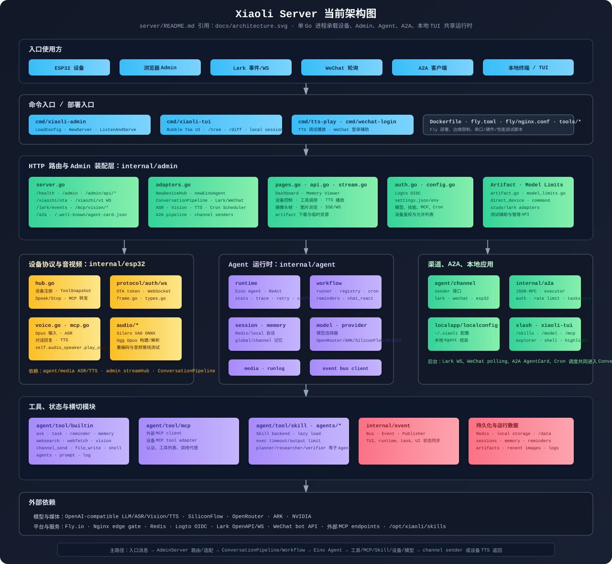

# Xiaoli



## Projects

- `server/`: Go server for device/admin backend on Fly.io.
- `tui/`: Local terminal UI for Xiaoli Agent.
- `xiaozhi-esp32/`: ESP32 firmware.

## C3 实时交互流水

在项目根目录运行 `./watch-c3.sh`，即可把 C3 USB 串口和 `xiaoli-server`
的 Fly 日志合并到一个时间线。脚本会自动寻找唯一的 ESPressif USB 串口；
设备暂时未连接时会等待，断开后也会重新连接。按 Ctrl-C 退出。

```sh
./watch-c3.sh
./watch-c3.sh --port /dev/cu.usbmodem14101  # 有多个 USB 串口时指定 C3
./watch-c3.sh --raw                      # 展开现有原始日志行
./watch-c3.sh --history                  # 包括 Fly 启动时回放的缓冲日志
```

需要本机已安装并登录 `flyctl`，以及项目的 `.espressif` Python 环境。
默认只显示这台 C3（`4c:11:ae:32:50:c8`）的关键事件，时间是本机收到日志的时间。
它汇总现有日志；未埋点的服务端出站 JSON 和逐帧音频内容不会凭空出现。
