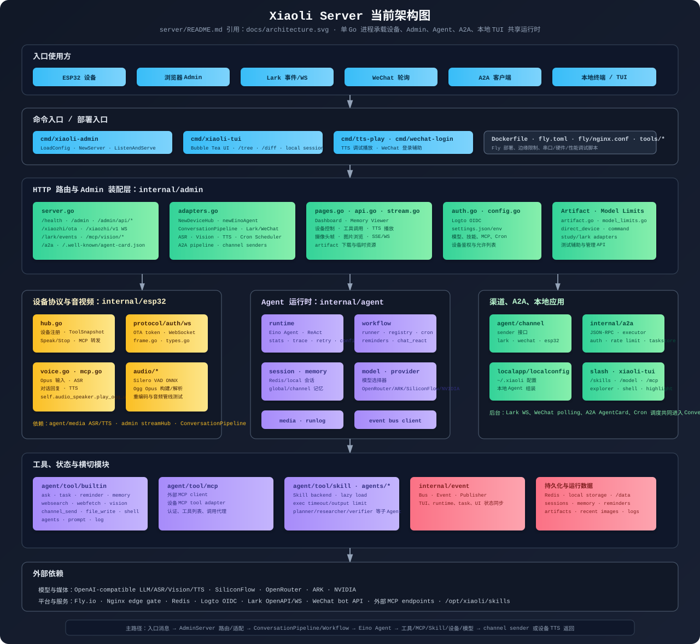

# Xiaoli Server on Fly.io



This directory deploys a Go-only Xiaoli device/admin backend to Fly.io.

The container runs a single Go process on port `8080`:

- `https://<app>.fly.dev/xiaozhi/ota/` issues the board WebSocket config
- `wss://<app>.fly.dev/xiaozhi/v1/` accepts the board WebSocket connection and MCP calls
- `https://<app>.fly.dev/lark/events` accepts Lark message events when `LARK_APP_ID` and `LARK_APP_TOKEN` are configured
- `https://<app>.fly.dev/mcp/vision/snapshot` and `/mcp/vision/stream/frame` receive camera uploads
- `https://<app>.fly.dev/admin` serves the Admin console
- Voice chat receives board Opus audio, runs ASR -> LLM/VLLM -> TTS, and asks the board to play Ogg Opus through `self.audio_speaker.play_ogg_url`
- Admin text playback uses the same Go TTS/playback path

## First Deploy

Install and log in:

```bash
brew install flyctl
fly auth login
```

Create the app once:

```bash
cd server
fly apps create xiaoli-server
```

If you change the app name, update `app` and `PUBLIC_BASE_URL` in `fly.toml`.

Set required model secrets. For the current defaults, the minimum useful set is:

```bash
fly secrets set NVIDIA_API_KEY=your_nvidia_key
fly secrets set OPENROUTER_API_KEY=your_openrouter_key
fly secrets set SILICONFLOW_API_KEY=your_siliconflow_key
fly secrets set SERVER_AUTH_KEY=$(openssl rand -hex 32)
fly secrets set ADMIN_SESSION_SECRET=$(openssl rand -hex 32)
fly secrets set LOGTO_APP_SECRET=your_logto_app_secret
fly secrets set STUDY_MONITOR_ENABLED=true LARK_BOT_WEBHOOK_URL=your_lark_webhook LARK_APP_ID=your_lark_app_id LARK_APP_TOKEN=your_lark_app_token
```

Server authentication is enabled by default. OTA is left reachable so devices
can check updates and fetch the current WebSocket URL. `ALLOWED_DEVICE_IDS` is
used by the Nginx edge gate for WebSocket and vision requests; it is not
rendered into the upstream `server.auth.allowed_devices` list, because that
upstream list bypasses token verification. Keep `SERVER_AUTH_KEY` as a Fly
secret and rotate it if it is ever exposed.

The admin console and device protocol are implemented in Go. Logto is the only
login path. Configure Logto with callback URL:

```text
https://xiaoli-server.fly.dev/admin/callback
```

and post-logout redirect URL:

```text
https://xiaoli-server.fly.dev/admin
```

Rotate the Logto app secret if it is ever exposed.

Deploy:

```bash
fly deploy --build-arg XIAOLI_SKILLS_CACHE_BUST=$(date +%Y%m%d%H%M%S)
```

`XIAOLI_SKILLS` defaults to floating installs such as `mnhkahn/cyeam-cli`.
Pass a fresh `XIAOLI_SKILLS_CACHE_BUST` value when deploying so Docker does not
reuse an older skill install layer.

Check health:

```bash
curl https://xiaoli-server.fly.dev/health
curl https://xiaoli-server.fly.dev/xiaozhi/ota/
```

## Local TUI

Install the local Xiaoli TUI into the current Go environment:

```bash
cd server
go install ./cmd/xiaoli-tui
```

Initialize local settings and secrets:

```bash
xiaoli-tui -init
```

Then edit `~/.xiaoli/settings.json` to set `models.default` and model
endpoints, and put API keys in `~/.xiaoli/secrets.json` or environment
variables. Run:

```bash
xiaoli-tui
```

After exit, the TUI prints the current session ID and a continue command. Resume
that session later with:

```bash
xiaoli-tui -s <session-id>
```

The local TUI reads shared skills from `~/.agents/skills` and Xiaoli-specific
skills from `~/.xiaoli/skills`. It loads prompts in this order when the files
exist:

1. `~/.agents/AGENT.md`
2. `~/.xiaoli/AGENT.md`
3. `~/.xiaoli/SOUL.md`

The TUI reuses the server slash command handler. Useful local commands include
`/skills`, `/model list`, `/model use <id>`, `/sessions`, `/resume <id>`,
`/session <id>`, `/memory list`, `/mcp`, `/tasks`, `/log <keyword>`, and
`/reminder list`. Local log search also supports `/log --all`, `/log --tools`,
and `/log --errors`. When bash is enabled and a command needs approval, reply
with `允许` or `拒绝` in the TUI.

Model-visible built-in tools in local TUI include web search, optional web
fetch, local memory, local run-log search, tasks, reminders stored at
`~/.xiaoli/state/reminders.json`, and `file_write` under
`tools.allowed_roots`. `bash` is available when `tools.bash` is true.

Runtime logs are written to `~/.xiaoli/logs/tui.log` so they do not corrupt the
terminal UI. The main transcript keeps only readable agent events and assistant
output. Use the mouse wheel, Up/Down, PgUp/PgDn, Ctrl+U/Ctrl+D, Home, and End to
scroll inside the TUI. The right sidebar keeps status, model, cwd, context
usage, task/MCP summaries, and key hints visible with a fixed-priority layout.

## Firmware OTA URL

After the Fly app is deployed, rebuild the firmware with:

```text
CONFIG_OTA_URL="https://xiaoli-server.fly.dev/xiaozhi/ota/"
```

Then flash the board.

## Configuration

Important environment variables:

- `PUBLIC_BASE_URL`: public HTTPS base URL, for example `https://xiaoli-server.fly.dev`
- `ENABLE_SERVER_AUTH`: default `true`; OTA issues WebSocket tokens and the WebSocket server verifies them
- `ALLOWED_DEVICE_IDS`: comma-separated device IDs allowed through Nginx for WebSocket and vision requests
- `SERVER_AUTH_KEY`: signing key for WebSocket and vision tokens; set as a secret
- `SERVER_AUTH_ALLOWED_DEVICE_IDS`: optional upstream bypass list; normally leave empty so token verification is not bypassed
- `XIAOLI_ADMIN_ENABLED`: enables the admin console when `true`
- `XIAOLI_ADMIN_PORT`: Go server port; default `8080` on Fly
- `XIAOLI_DIRECT_DEVICE_SERVER`: when `true`, Admin controls the board directly through Go instead of the old bridge
- `ADMIN_SESSION_SECRET`: signing key for admin cookies; set as a secret
- `LOGTO_ENDPOINT`: Logto tenant endpoint, for example `https://fpilyb.logto.app/`
- `LOGTO_APP_ID`: Logto application ID
- `LOGTO_APP_SECRET`: Logto application secret; set as a secret
- `ADMIN_ALLOWED_USERS`: optional comma-separated Logto sub/email/username/name allowlist; `*` allows all authenticated users
- `LARK_BOT_WEBHOOK_URL`: custom bot webhook URL; set as a secret
- `LARK_APP_ID`: Lark app ID; when set together with `LARK_APP_TOKEN`, enables `/lark/events`
- `LARK_APP_TOKEN`: Lark app token used as the app credential for tenant access tokens; set as a secret
Model and MCP settings:

- `settings.json`: stores non-secret model endpoints, model names, `/model` options, ASR/Vision/TTS settings, and MCP server URLs. Each model option can set `max_tokens` (default 180) and `api_key_env` to reference a Fly secret.
- `AGENT.md`: stores the default agent prompt. Optional `SOUL.md` is appended when present.
- `SILICONFLOW_API_KEY`: secret used by the default settings via `api_key_env`.
- Other provider keys, such as `NVIDIA_API_KEY`, `OPENROUTER_API_KEY` or `OPENAI_API_KEY`, can be referenced from `settings.json` with `api_key_env`.
- The Docker image copies `settings.json` and `AGENT.md` to `/opt/xiaoli/`, alongside `/opt/xiaoli/skills`.

Skill support:

- The Docker image installs every skill from build arg `XIAOLI_SKILLS` into `/opt/xiaoli/skills`; default is `mnhkahn/cyeam-cli`, which currently contributes multiple skills such as `cyeam-cli`, `live-broadcast`, `holiday`, `mo`, `roadbook`, and related cyeam workflows.
- Executable files under each skill's `bin/` directory are copied to `/usr/local/bin`. The image also installs the `cyeam` binary for `cyeam-cli` if the skill package does not include one.
- `XIAOLI_SKILL_ROOTS`: comma-separated skill roots; default `/opt/xiaoli/skills`.
- `XIAOLI_ENABLED_SKILLS`: comma-separated allowlist; default `*` enables every indexed skill.
- `XIAOLI_SKILL_MAX_BYTES`: maximum bytes per loaded `SKILL.md`; default `65536`.
- `XIAOLI_SKILL_EXEC_TIMEOUT_SECONDS`: maximum runtime for a skill CLI invocation; default `8`.
- `XIAOLI_SKILL_EXEC_MAX_OUTPUT_BYTES`: maximum captured stdout bytes; default `262144`.
- `XIAOLI_SKILL_EXEC_GLOBAL_BIN_DIRS`: comma-separated global executable allowlist; default `/usr/local/bin`.
- At startup the server indexes only Skill frontmatter. During an agent run, Eino exposes a `skill` tool; the model calls it with a skill name to lazily load the full `SKILL.md`.

Use `fly secrets set` for keys. Do not commit real keys.

## Memory（用户记忆）

Xiaoli 是单用户系统。记忆存储在 Redis，每轮对话自动加载。

两种作用域（LLM 工具的 `scope` 参数可选，默认 `global`）：

| 作用域 | Redis Key | 说明 |
|--------|-----------|------|
| `global` | `{prefix}memory:global` | 全局共享。不区分频道和用户，所有设备/频道共享同一份记忆 |
| `channel` | `{prefix}memory:{channel}:{user}` | 频道内独立。比如 Lark 和 ESP32 的记忆不互通 |

**关键假设**：系统是单人使用的，`global` 没有全局用户 ID。如果将来需要多用户隔离，需引入全局用户标识（如 Logto sub）。

## Cron 定时任务

Cron 任务配置在 `settings.json` 的 `"cron"` 字段，不再是环境变量。支持两种触发器：

- **interval 型**（`every` + 可选 `start_hour`/`end_hour` 时间窗）
- **固定时间型**（`at_hour` + `at_minute`，必须成对出现）

示例：

```json
"cron": {
  "study_monitor": {
    "enabled": false,
    "trigger": { "every": "5m", "timezone": "Asia/Shanghai", "start_hour": 17, "end_hour": 21 },
    "agent": { "name": "dispatch_agent", "mode": "react", "max_steps": 6, "timeout": "150s" },
    "metadata": { "camera_tool": "self.camera.take_photo", "reminder_text": "请坐直，认真学习。", "tool_timeout": "120s" }
  },
  "morning_greeting": {
    "enabled": true,
    "trigger": { "at_hour": 8, "at_minute": 0, "timezone": "Asia/Shanghai" },
    "agent": { "name": "dispatch_agent", "mode": "react", "max_steps": 4, "timeout": "120s" },
    "metadata": { "text": "早上好。" }
  }
}
```

斜杠命令：`/cron list` 查看定时任务，`/cron run <任务ID>` 立即执行。

## MCP 外部服务

`settings.json` 的 `"mcp_servers"` 支持 `api_key_env` 字段引用环境变量中的 API key：

```json
{
  "name": "AMap",
  "url": "https://mcp.amap.com/mcp",
  "api_key_env": "AMAP_API_KEY"
}
```

Key 由 MCP 客户端在请求时静默注入 URL query 参数，不进入日志。`api_key_env` 非空但未配置时跳过该服务。

配置方式：

```bash
fly secrets set AMAP_API_KEY=你的高德APIKey
```
